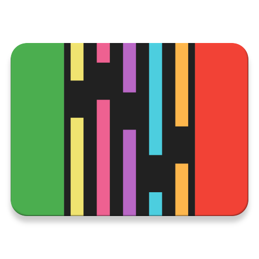
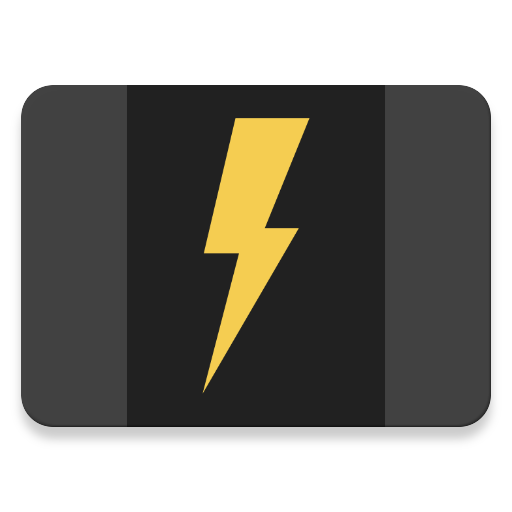

# Designs

## Logos
Created with [Inkscape](http://www.inkscape.org/) - the final app icons are generated using [Android Asset Studio](https://romannurik.github.io/AndroidAssetStudio/icons-launcher.html)

| Version 1 | Version 2 | Version 3 | Version 4 | Version 5 |
|:---------:|:---------:|:---------:|:---------:|:---------:|
|  |  |  |  | 

## Mockups
Created with [Draw.io](https://draw.io)

* Version 1

* Version 2

* Version 3

