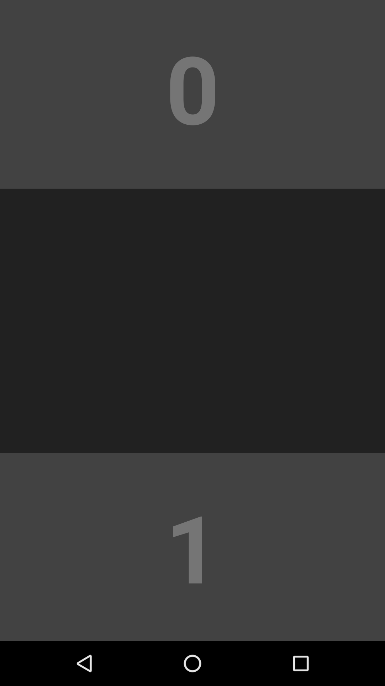

# Screenshots

Taken with Android Studio Emulator, on a Nexus 5X API 24

## Launcher

## Preferences

 

## Match

  

### Levels

#### Color

  

#### Countdown

  

#### Light

TODO

#### Collision

TODO

#### TicTacToe

TODO

#### Pair

TODO

#### Variety

#### Fit

TODO

#### Singular

TODO

#### Labyrinth

TODO
