# Screenshots

Taken with Android Studio Emulator, on a Nexus 5X API 24

## Launcher

## Preferences

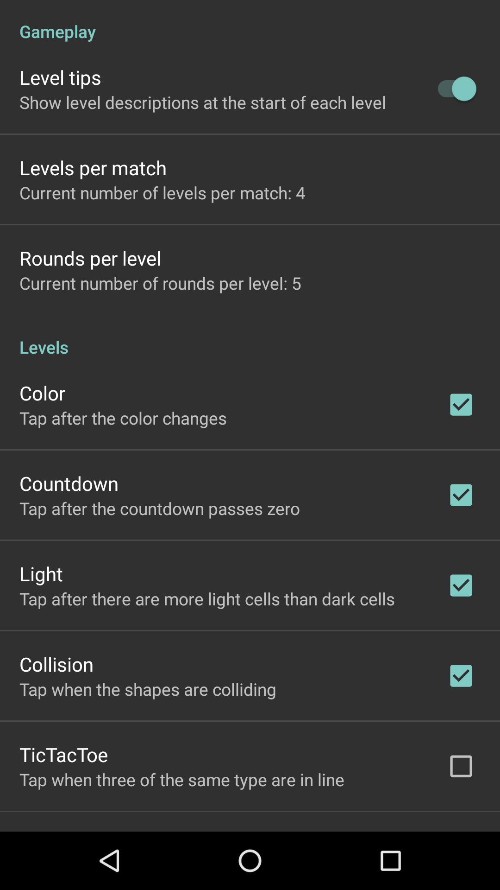 

## Match

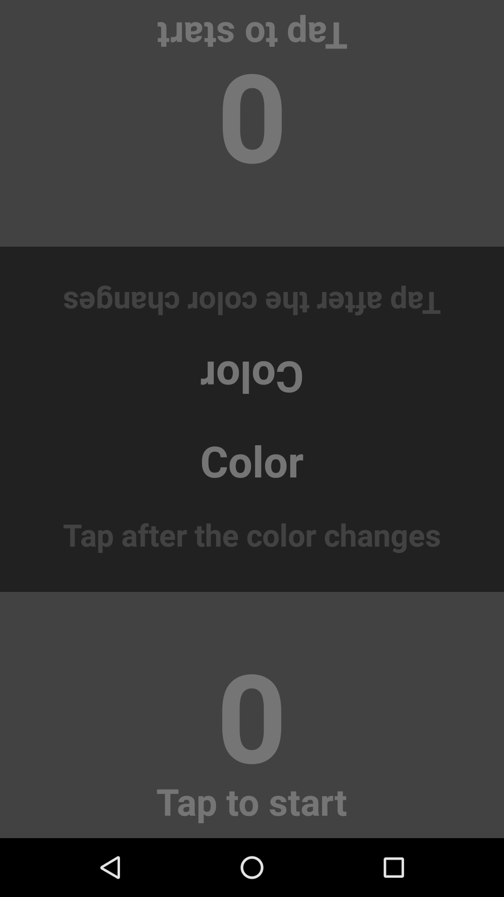 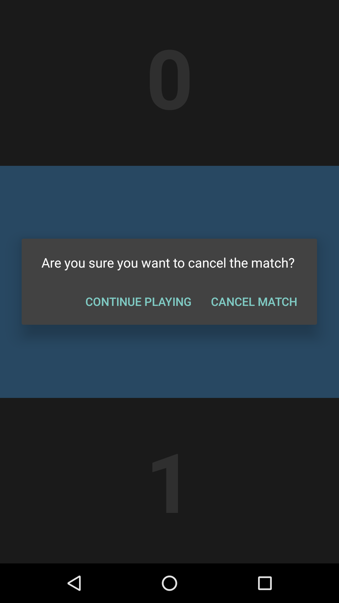  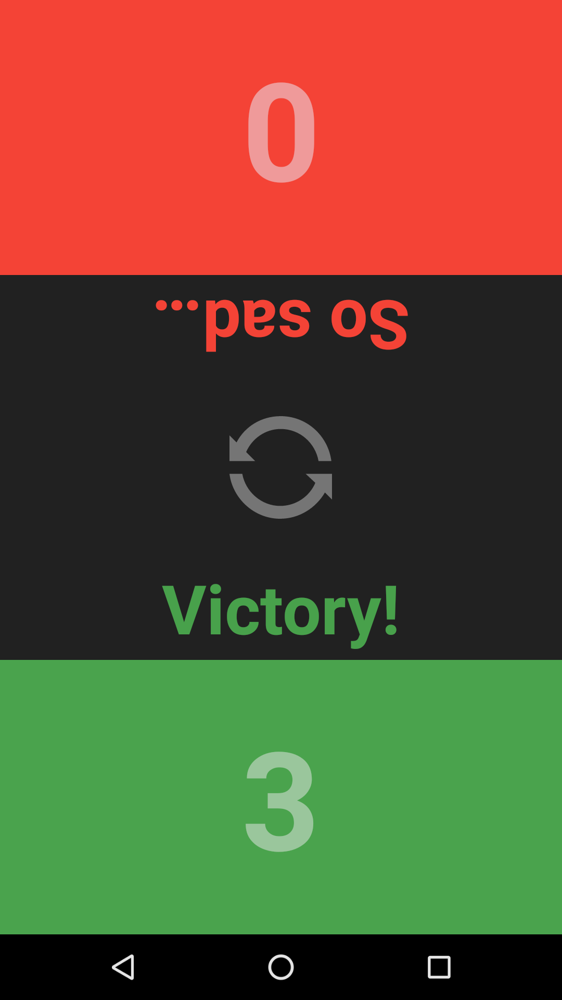

### Levels

#### Collision

 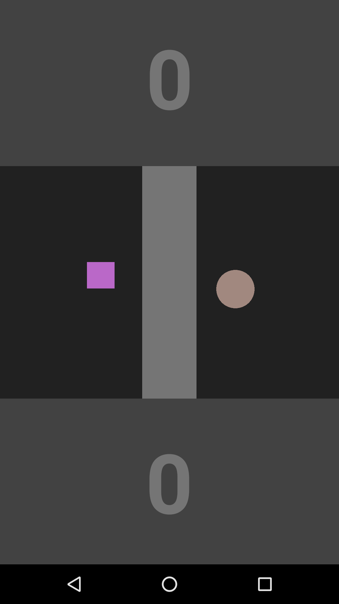  

#### Color

  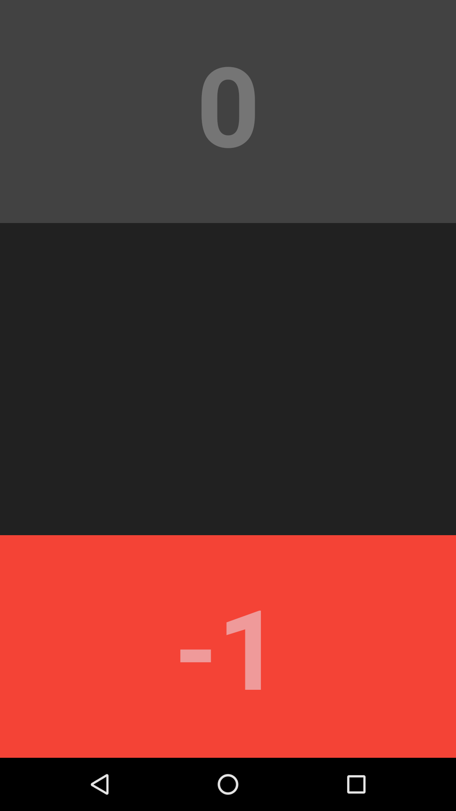 

#### Countdown

 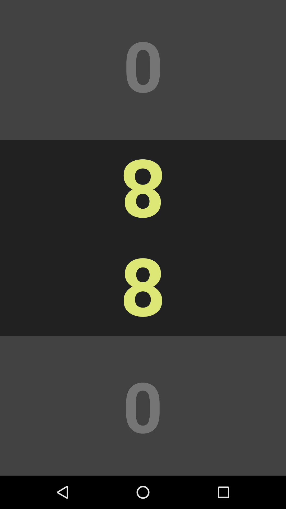 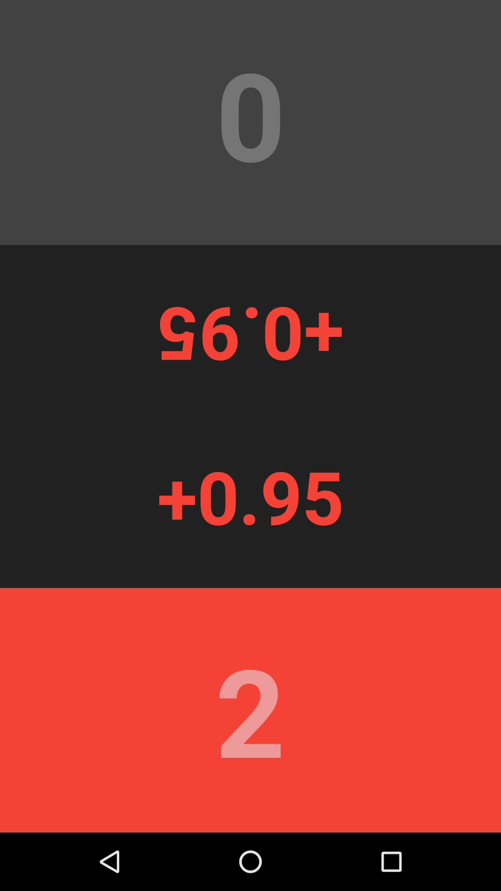 

#### Fit

  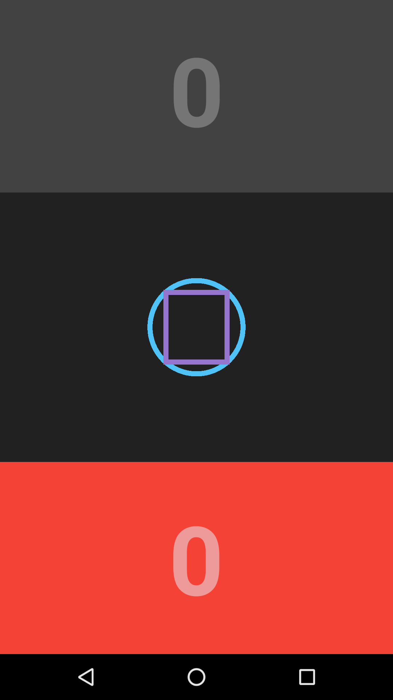 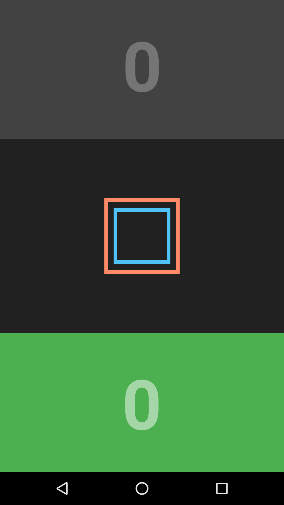

#### Hole

   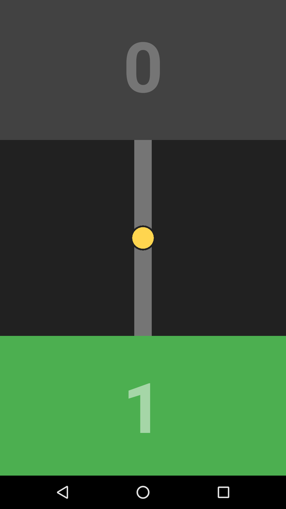

#### Labyrinth

TODO

#### Light

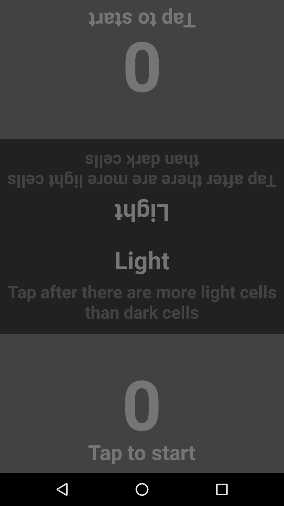 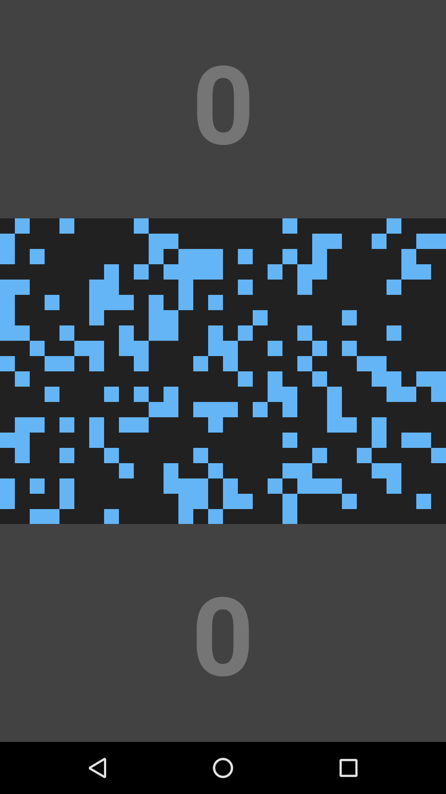  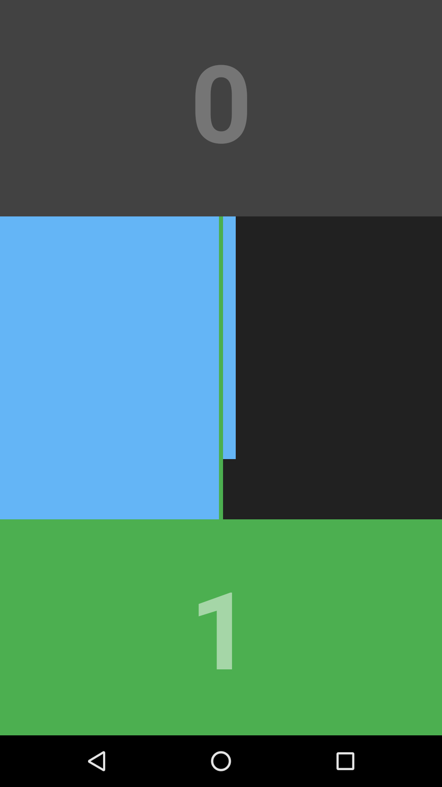

#### Lined

TODO

#### Pair

TODO

#### Singular

TODO

#### Variety

TODO
